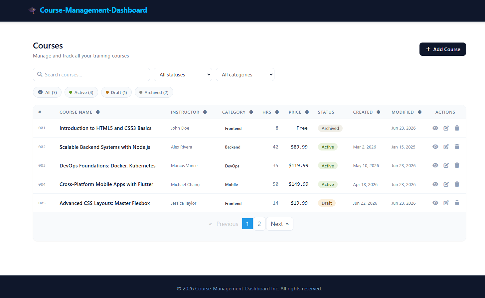
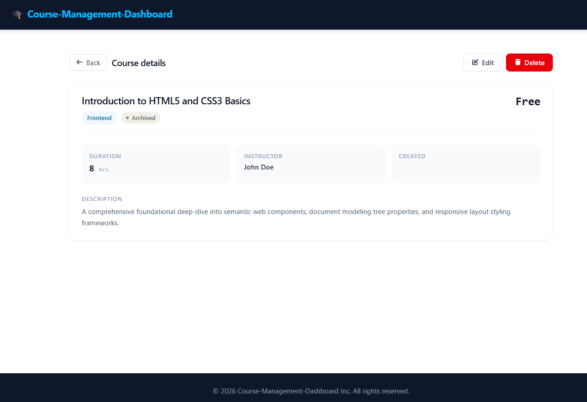
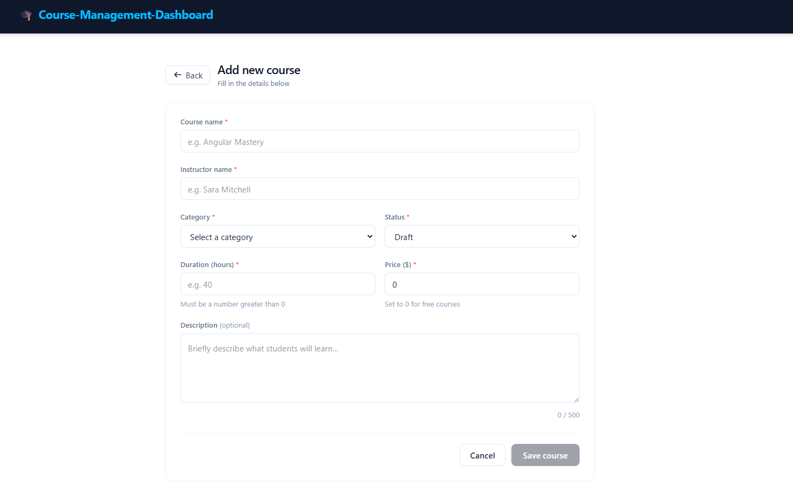

# Course Management Dashboard

A lightweight Angular dashboard for managing courses, built with Angular 21 and a local mock API using `json-server`.

## Screenshots




## Project overview

This application provides a course management UI with features such as:
- course listing and filtering
- course creation and editing
- course details viewing
- mock backend data served from a local JSON file

The project uses the following libraries:
- Angular 21.2.x
- `ngx-pagination`
- `ngx-spinner`
- `ngx-toastr`
- `json-server` for the mock REST API

## Repository structure

Key folders and files:
- `src/app/features/courses/` - course feature module and pages
- `src/app/core/` - shared application core services, guards, interceptors, and layout components
- `src/app/shared/` - reusable shared components such as dialogs and not-found page
- `db.json` - local mock API data source
- `package.json` - project scripts and dependencies

## Prerequisites

Install Node.js and npm. This repository uses npm and Angular CLI.

## Setup

From the repository root:

```bash
npm install
```

## Run the mock API

The mock backend runs with `json-server` and exposes the data in `db.json`.

Start the API server:

```bash
npm run api
```

Open the API endpoint in your browser or API client:

- `http://localhost:3000/courses`

This serves the courses collection used by the Angular app.

## Run the Angular application

Start the Angular development server:

```bash
npm start
```

Then open:

- `http://localhost:4200/`

The app will reload automatically when you modify source files.

## Recommended workflow

1. Open two terminal windows.
2. Run `npm run api` in one terminal to start the mock backend on port `3000`.
3. Run `npm start` in the other terminal to start the Angular app on port `4200`.
4. Use the app UI to view, add, edit, or delete courses.

## Available scripts

- `npm start` - launches the Angular dev server
- `npm run api` - starts `json-server` with `db.json` on `http://localhost:3000`
- `npm run build` - builds the app for production
- `npm run watch` - builds the app in watch mode for development
- `npm test` - runs unit tests

## Mock data

The mock API data is stored in `db.json` and currently includes a `courses` collection with sample course objects.

## Notes

- The app expects the mock API to be running when interacting with course CRUD operations.
- If ports `4200` or `3000` are already in use, change them in the Angular CLI and `json-server` command as needed.

## Useful links

- Angular: https://angular.dev/
- json-server: https://github.com/typicode/json-server
